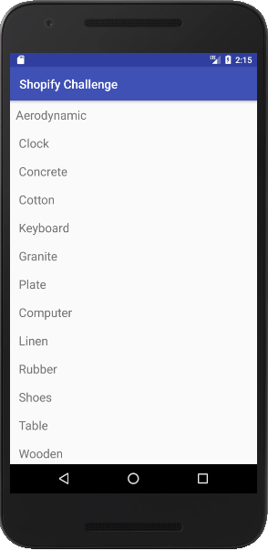
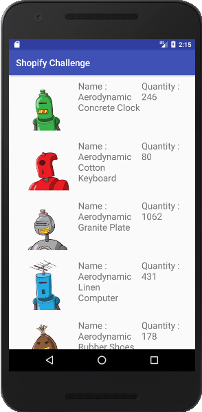

# ShopifyChallenge
An android application to fetch data and bitmaps from a link or server and show it in recycer view with and without images. It have following two activities:-

# MainActivity
In this activity, I am fetching data from an API link and sorting that data to create tag list page (e.g. Aerodynamic, Clock, Concrete). Clicking on a tag launches the Products which contains respective tag.

# ProductListActivity
In this activity, I am showing a list of every product that contains the selected tag with the image in a recyclerview. Each row in the list contain the name of the product and the total available inventory across all variants of the product.

